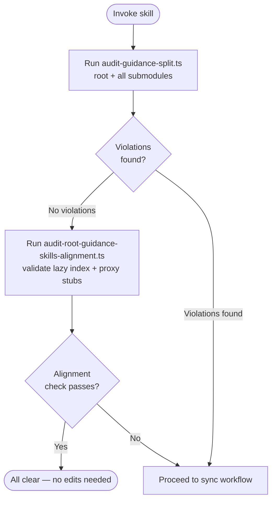
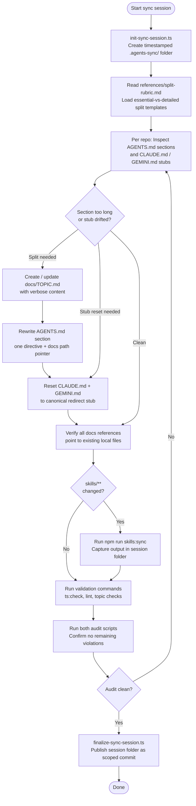

# agents-sync
A guidance-sync toolkit for keeping `AGENTS.md`, `CLAUDE.md`, and `GEMINI.md` coherent across repository boundaries — packaged as a Claude Agent Skill. It audits whether `AGENTS.md` sections are too detailed and lack topic-doc references, verifies that `CLAUDE.md` and `GEMINI.md` are minimal redirect stubs, and drives a structured workflow for splitting verbose sections into repo-local `docs/*.md` files. Covers both the root repository and every git submodule in `.gitmodules`.

## Install

The fastest cross-agent install path is the `skills` CLI:

```bash
npx skills add gg-skills/agents-sync
```

Drop this skill into a workspace as a Git submodule for pinned versions, or as a plain clone for latest `main`:

```bash
# Project-local, version-pinned:
git submodule add git@github.com:gg-skills/agents-sync.git .claude/skills/agents-sync

# OR project-local, latest main:
mkdir -p .claude/skills
git -C .claude/skills clone git@github.com:gg-skills/agents-sync.git

# OR user-level, available in every project on this machine:
mkdir -p ~/.claude/skills
git -C ~/.claude/skills clone git@github.com:gg-skills/agents-sync.git
```

Restart your agent or reload skills after installation. See the parent [`skills` catalog repo](https://github.com/gg-skills/skills) for the full catalog.

## When to use

- `AGENTS.md`, `CLAUDE.md`, or `GEMINI.md` were edited in the root repo or a submodule and need reconciliation.
- `AGENTS.md` sections exceed ~6 lines and lack a `docs/*.md` reference.
- `CLAUDE.md` or `GEMINI.md` contain policy beyond a minimal `AGENTS.md` redirect stub.
- Multiple repos changed guidance in parallel and need cross-repo reconciliation.
- `npm run check:guidance-skills-alignment` fails in the host project.

Skip it when the task is editing source code, tests, or configuration without touching guidance files, or when only one repo is involved and its `AGENTS.md` is already concise with valid docs references.

## How it operates

### Inputs

**Files read across root + submodules:**
- `AGENTS.md` — audited for section length, docs-reference pointers, and policy content.
- `CLAUDE.md` / `GEMINI.md` — verified to contain only a minimal redirect stub.
- `docs/*.md` — inspected for local-path references from `AGENTS.md`.
- `references/split-rubric.md` — loaded on demand when splitting or resetting proxy stubs.
- `.gitmodules` — used to enumerate all submodules in scope.

**Environment / flags (no required env vars; optional flags per script):**

| Flag | Script | Effect |
|------|--------|--------|
| `--json` | audit scripts | Machine-readable JSON output |
| `--strict` | audit scripts | Non-zero exit on any violation (CI gate mode) |
| `--name <session-name>` | `init-sync-session.ts` | Names the timestamped working directory |
| `--session-dir <path>` | `finalize-sync-session.ts` | Targets an existing session folder for publish |
| `--include-path <path>` | `finalize-sync-session.ts` | Adds a repo-relative path to a scoped publish commit |
| `--dry-run` | `finalize-sync-session.ts` | Previews the publish commit without writing |

### Outputs

**Session folder** — created by `init-sync-session.ts` under `.agents-sync/YYYY-MM-DD-<session-name>/`:
- Findings log, audit output, and guidance deltas captured during the session.
- Published by `finalize-sync-session.ts` as a scoped commit.

**Updated guidance files** — edited in-place across root + submodule repos:
- `AGENTS.md` — verbose sections replaced with a short directive + local docs reference.
- `CLAUDE.md` / `GEMINI.md` — reset to the canonical redirect stub from `references/split-rubric.md`.
- `docs/*.md` — new or updated topic files carrying the content moved out of `AGENTS.md`.

**Audit reports** — written to stdout (or as JSON with `--json`); no files created by audit scripts alone.

### External commands

| Script | Invocation | What it does |
|--------|------------|-------------|
| `audit-guidance-split.ts` | `npx tsx skills/agents-sync/scripts/audit-guidance-split.ts` | Audits `AGENTS.md` content, proxy stubs, and docs references across root + submodules |
| `audit-root-guidance-skills-alignment.ts` | `npx tsx skills/agents-sync/scripts/audit-root-guidance-skills-alignment.ts` | Validates the root `AGENTS.md` lazy skill-index stanza, proxy stubs, and generated skill indexes |
| `init-sync-session.ts` | `npx tsx skills/agents-sync/scripts/init-sync-session.ts --name "<name>"` | Creates a timestamped `.agents-sync/` working directory |
| `finalize-sync-session.ts` | `npx tsx skills/agents-sync/scripts/finalize-sync-session.ts --session-dir <path>` | Publishes a session folder with an optional scoped commit |

Add `--json` or `--strict` to either audit script for CI-gate usage.

### Side effects

- **Creates `.agents-sync/YYYY-MM-DD-<session-name>/`** in the host repo when `init-sync-session.ts` runs.
- **Writes or rewrites** `AGENTS.md`, `CLAUDE.md`, `GEMINI.md`, and `docs/*.md` in root and submodule repos when the sync workflow applies edits.
- **Commits and pushes** a scoped artifact when `finalize-sync-session.ts` runs (unless `--dry-run`).
- **Triggers `npm run skills:sync`** from the host project root when any `skills/**` files are changed during a session.

### Mode toggles

| Mode | How to activate | Effect |
|------|----------------|--------|
| Audit-only | Run either audit script without `--strict` | Report findings to stdout; no file writes |
| CI gate | Add `--strict` to any audit script | Non-zero exit on any violation; no file writes |
| JSON output | Add `--json` | Machine-readable audit output instead of human-readable prose |
| Dry-run publish | Add `--dry-run` to finalize script | Preview the scoped commit without writing |
| Diagnostic-first | Run audit scripts with `--json` before loading references | Scope-limits which reference files get loaded |

## Operational flow

### Audit phase



### Sync + publish phase



## Layout

```
.
├── SKILL.md                ← entry point: frontmatter, workflow, policy, script inventory
├── agents/
│   └── openai.yaml         ← IDE / agent descriptor
├── assets/                 ← skill icons (large/small/master + SVG sources)
├── references/
│   └── split-rubric.md     ← essential-vs-detailed split templates and proxy-stub canonical forms
└── scripts/
    ├── audit-guidance-split.ts               ← audits AGENTS.md sections + proxy stubs across all repos
    ├── audit-root-guidance-skills-alignment.ts ← validates root lazy skill-index + generated indexes
    ├── init-sync-session.ts                  ← creates a timestamped .agents-sync/ working directory
    ├── finalize-sync-session.ts              ← publishes session folder as a scoped commit
    └── lib/
        ├── finalize-scoped-artifact.ts       ← shared helpers for scoped artifact commits
        └── skill-index.ts                    ← shared helpers for reading and validating skill indexes
```

## Quick start

Run the split audit first to discover what needs fixing:

```bash
# Audit AGENTS.md sections, proxy stubs, and docs references across root + submodules
npx tsx skills/agents-sync/scripts/audit-guidance-split.ts

# Audit root AGENTS.md lazy skill-index stanza and generated skill indexes
npx tsx skills/agents-sync/scripts/audit-root-guidance-skills-alignment.ts
```

Add `--json` for machine-readable output; add `--strict` for CI-gate usage (non-zero exit on violations).

When violations are found, initialize a session folder and begin the sync workflow:

```bash
# Initialize a timestamped sync session folder
npx tsx skills/agents-sync/scripts/init-sync-session.ts --name "guidance-split-pass"

# ... edit AGENTS.md, CLAUDE.md, GEMINI.md, and docs/*.md per split-rubric.md ...

# Publish the completed session
npx tsx skills/agents-sync/scripts/finalize-sync-session.ts \
  --session-dir ".agents-sync/2026-05-17-guidance-split-pass"
```

For CI gates, wire into `package.json`:

```json
{
  "scripts": {
    "check:guidance-skills-alignment": "npx tsx skills/agents-sync/scripts/audit-root-guidance-skills-alignment.ts --strict"
  }
}
```

## Resources

- [`SKILL.md`](./SKILL.md) — full operating guidance: policy, workflow, script inventory, troubleshooting matrix.
- [`references/split-rubric.md`](./references/split-rubric.md) — essential-vs-detailed split templates and canonical proxy-stub forms.
- [`agents/openai.yaml`](./agents/openai.yaml) — generated agent metadata for IDE surfaces.
- [`scripts/audit-guidance-split.ts`](./scripts/audit-guidance-split.ts) — main audit script for section length and proxy stubs.
- [`scripts/audit-root-guidance-skills-alignment.ts`](./scripts/audit-root-guidance-skills-alignment.ts) — root alignment audit.
- [`scripts/init-sync-session.ts`](./scripts/init-sync-session.ts) — session folder initialization.
- [`scripts/finalize-sync-session.ts`](./scripts/finalize-sync-session.ts) — session publish and scoped commit.
- [`assets/`](./assets/) — skill icons.

## Caveats

- **Never reconstruct guidance content from memory.** Always read `references/split-rubric.md` before writing any `AGENTS.md` section, proxy stub, or topic doc. Incorrect stubs accumulate silently.
- **`CLAUDE.md` and `GEMINI.md` must be identical in meaning.** They are redirect stubs only — no repo-specific policy beyond the redirect. Diverging stubs are a violation.
- **`AGENTS.md` must retain one directive + one docs pointer after a split.** Moving all content to `docs/*.md` without leaving a directive is an incomplete split and breaks the audit.
- **No cross-repo docs references.** Every `AGENTS.md` must reference its own repo-local `docs/` path. Absolute URLs or paths into another repo's `docs/` are prohibited by non-negotiable policy.
- **`skills:sync` is mandatory after any `skills/**` change.** Skipping it leaves generated IDE skill indexes stale. Include the `skills:sync` output in the session publish.
- **Run both audit scripts before every session closeout.** Undetected drift accumulates quickly across repos — the split audit finds what to fix; the alignment audit confirms the root repo's generated indexes and proxy stubs.
- **The finalize script must be run to close a session.** Session folders left unpublished cannot be referenced in handoff outputs to `plan` or host documentation-sync workflows.
